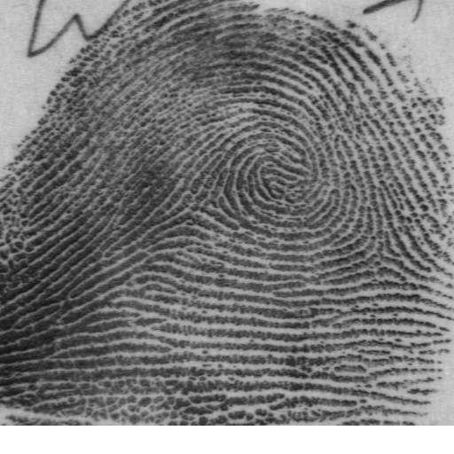

# Machine Learning Engineer Nanodegree

## Capstone Proposal

Rafael Henrique Tibães

_December 01, 2017_

---

## Proposal

### Domain Background

In biometrics there are two main operations: verification (1:1) and identification (1:N). Verification is the process to confirm a person's identity based on its biometrics. Identification is the process to identify a person's identity based on its biometrics, i.e. searching the correspondent biometric model in the database. A naive identification algorithm would perform the verification procedure for each person's biometric model stored in the database. To reduce the computational costs, a clever approach would compute indexes for each biometric model in the database. With a properly indexed database, the identification process would require to perform the verification algorithm only in a reduced subset of the database.

I am particularly interested in this problem because I need a solution for a complex newborn fingerprint identification platform that I am working with. In a real world application it would be easy to have a huge database, which would take a very long time to compute a naive identification algorithm. Proprietary technology is capable to achieve a high speed identification feedback, however they are not suitable for our needs. Kai et Al. [1] uses a Convolutional Neural Network (CNN) to identify the pattern of small fingerprint patches, targeting forensics applications. In this work we adapt this algorithm to compute the most basic fingerprint indexation: the ridge pattern.

### Problem Statement

Accordingly to _NIST_ [2] there are five fundamental classes of fingerprint: i) Arch, ii) Left Loop, iii) Right Loop, iv) Tented Arch, and v) Whorl. If we could compute the fundamental type of every fingerprint, this information could be used to perform the database indexation. Using just this indexation we have a potential to perform the identification task (1:N) almost five times faster! Strong solutions to image classification tasks usually rely on Convolutional Neural Network (CNN). In this work we plan to use a CNN to classify the fundamental type of a fingerprint. This is a multi-class classification problem, with well established metrics for accuracy. Given a database of labeled fingerprint images, containing the fundamental type information, the algorithm should give the same answer as the database labels.

### Datasets and Inputs

For this work, the ideal dataset should contain fingerprint images paired with notations about the fundamental type information. _NIST Special Database 4_ [2][3] was developed for this purpose and is free for research. In this dataset, all images are stored in gray scale _PNG_ files, having a dimension of _512 x 512_ pixels. The fingerprints images were acquired under varying conditions, so there are images with good and others with poor quality. The quality is affected mostly by the skin's humidity and the pressure applied on sensor. As result, a poor quality image have blurred borders, making it harder to distinguish ridges from valleys. A database sample of the pair fingerprint image & notations is presented in Figure 1.



### Solution Statement

In literature there are lot of examples demonstrating the capability that Convolution Neural Networks have to handle image classification problems. Our approach is inspired by the network of Kai et Al. [1], so it will be composed by a few convolutional layers, followed by max-pooling and fully-connected layers, and finally the output layer. As input we use the dataset images. The output matches the fundamental type classes, so the output layer has only five nodes, one for each class: i) Arch, ii) Left Loop, iii) Right Loop, iv) Tented Arch, and v) Whorl. This approach allows us to measure the performance of the algorithm by computing its accuracy using the dataset labels. We use a Python notebook with Keras and Tensorflow, inside a Docker container, so our experiments can be easily replicated.

### Benchmark Model

As I did not found in literature an algorithm for this exact purpose, I will compare the proposed approach with a random guess. In this manner, giving that we have five classes, our approach must achieve an accuracy above 20%, otherwise it would perform worse than picking a random value.

### Evaluation Metrics

The algorithm will be evaluated accordingly its accuracy to correctly classify the fundamental type of each fingerprint image in the _NIST Dataset_ [2]. To avoid overfitting, the dataset will be split in three subsets: training set, validation set and testing set. For the accuracy measurement it will be used the testing set. The accuracy represents the percentage of fingerprint fundamental type that were corrected labeled by the algorithm according the dataset labels.

### Project Design

The development of this project can be divided into three phases: preprocessing, training and testing. Preprocessing phase is composed by splitting the dataset into training, validation and testing sets; parsing the dataset labels; and converting images to 4D tensors. Training is composed by model architecture and effectively training the model. Finally, in testing phase, the optimal model is loaded and it is computed its accuracy over the testing set. Follows a list of these steps:

1. Slit dataset into train, validation and test.
2. Convert dataset notes into one-hot-encoded classification labels.
3. Convert fingerprint images into 4D Tensors in the form _(nb_samples, 512, 512, 1)_.
4. Model and compile the CNN architecture.
5. Train the model with multiple epochs, using training and validation sets.
6. Load the model with the best validation loss.
7. Compute the accuracy of the model.

The network architecture is presented in the following _summary_, provided by the Keras library. The network is composed by pairs of convolution and max-pooling layers, as a way to convert the spacial dimensions to a deep feature vector. The network have a dense layer to establish connections over features, followed by a dropout layer to minimize overfitting. Finally a dense layer of five nodes, one for each fundamental type class, representing our output.

```
Layer (type)                 Output Shape              Param #   
=================================================================
conv2d_4 (Conv2D)            (None, 512, 512, 16)      160       
_________________________________________________________________
max_pooling2d_4 (MaxPooling2 (None, 256, 256, 16)      0         
_________________________________________________________________
conv2d_5 (Conv2D)            (None, 256, 256, 32)      4640      
_________________________________________________________________
max_pooling2d_5 (MaxPooling2 (None, 128, 128, 32)      0         
_________________________________________________________________
conv2d_6 (Conv2D)            (None, 128, 128, 64)      18496     
_________________________________________________________________
max_pooling2d_6 (MaxPooling2 (None, 64, 64, 64)        0         
_________________________________________________________________
global_average_pooling2d_2 ( (None, 64)                0         
_________________________________________________________________
dense_3 (Dense)              (None, 100)               6500      
_________________________________________________________________
dropout_2 (Dropout)          (None, 100)               0         
_________________________________________________________________
dense_4 (Dense)              (None, 5)                 505       
=================================================================
Total params: 30,301
Trainable params: 30,301
Non-trainable params: 0
_________________________________________________________________
```

# References

[1] Cao, Kai, and Anil K. Jain. "Latent orientation field estimation via convolutional neural network." Biometrics (ICB), 2015 International Conference on. IEEE, 2015.

[2] https://www.nist.gov/srd/nist-special-database-4

[3] https://www.nist.gov/itl/iad/image-group/resources/biometric-special-databases-and-software