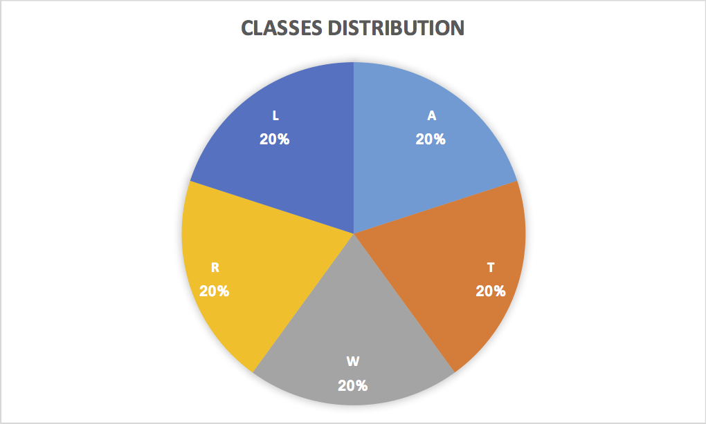

# Machine Learning Engineer Nanodegree

## Capstone Report

Rafael Henrique Tibães

_December 22, 2017_

---

## Definition

In biometrics there are two main operations: verification (1:1) and identification (1:N). Verification is the process that confirms a person's identity based on their biometrics. Identification is the process to identify a person's identity based on its biometrics, i.e. searching the correspondent biometric model in the database. A naive identification algorithm would perform the verification procedure for each person's biometric model stored in the database. To reduce the computational costs, a clever approach would compute indexes for each biometric model in the database. With a properly indexed database, the identification process would require to perform the verification algorithm only in a reduced subset of the database.

There are a couple of biometrics modalities capable to accurately identify an individual, such as the face, fingerprint and iris. In this work we focus on fingerprints accquired by imaging sensors. Fingerprints are composed by ridges (darker pixels) and valleys (lighter pixels), where each fingerprint has an unique composition of ridges and valleys. Despite the unique composition, all fingerprints follow one of the five fundamental types, i.e. ridge patterns, described by _NIST_ [2]: i) Arch, ii) Left Loop, iii) Right Loop, iv) Tented Arch, and v) Whorl. If we could compute the fundamental type of every fingerprint, this information could be used to perform the database indexation. Using just this indexation we would be able to perform the identification task (1:N) almost five times faster!

I am particularly interested in this problem because I need a solution for a complex newborn fingerprint identification platform that I'm working on. In a real world application it would be easy to have a huge database, which would take a very long time to compute a naive identification algorithm. Proprietary technology is capable to achieve a high speed identification feedback, however they are not suitable for our needs.

Inspired by the Udacity _dog breed_ assignment and also by the work of Kai et Al. [1], which uses a Convolutional Neural Network (CNN) to identify the pattern of small fingerprint patches targeting forensics applications,  in this work we trained a network to compute the most basic fingerprint indexation: the ridge pattern. This is a multi-class classification problem with well established metrics for accuracy. Given a database of labeled fingerprint images, containing the fundamental type information, the algorithm should give the same answer as the database labels.

## Analisys

For this work, the ideal dataset should contain fingerprint images paired with notations about the fundamental type information. _NIST Special Database 4_ [2][3] was developed for this purpose and is free for research. In this dataset all images are stored in gray scale _PNG_ files having a dimension of _512 x 512_ pixels. The fingerprints images were acquired under varying conditions, so there are images with good and others with poor quality. The quality is affected mostly by the skin's humidity and the pressure applied on sensor. As result, a poor quality image have blurred borders, making it harder to distinguish ridges from valleys.

The _NIST_ dataset contains `4000` fingerprint images, uniformly distributed along the five fundamental types, i.e. there are `800` fingerprint images of each class:  i) (A) Arch, ii) (L) Left Loop, iii) (R) Right Loop, iv) (T) Tented Arch, and v) (W) Whorl. This is an important feature, because for classification tasks it is fundamental to balance the dataset before training. Figures 1 to 5 are fingerprints samples from this dataset, to present the characteristics of each fundamental type, and Figure 6 presents the data distribution.




Image classification can be achieved by different algorithms, such as Perceptrons, Support Vector Machines (SVM) and Convolutional Neural Networks (CNN). In recent competitions of  image classification it is common for CNN to be ranked as the most accurate algorithm, using complex networks such as _AlexNet_, _Inception_ and _ResNet_. In this work we adopted CNN for its robustness and accuracy, building a simple network inspired by the work of Kai et Al. [1].

The algorithm will be evaluated accordingly to its accuracy to correctly classify the fundamental type of each fingerprint image in the _NIST Dataset_ [2]. To avoid overfitting, the dataset will be split in three subsets: training set, validation set and testing set. For the accuracy measurement it will be used the testing set. The accuracy represents the percentage of fingerprint fundamental type that were corrected labeled by the algorithm according the dataset labels.

As I haven't found in literature an algorithm for this exact purpose, I will compare the proposed approach with a random guess. In this manner, giving that we have five classes, our approach must achieve an accuracy above 20%, otherwise it would perform worse than picking a random value.

## Methodology

Usually, an image classification algorithm requires pre-processing of the image data. In this work, this pre-processing is composed by three modules: i. conversion of images to tensors, ii. conversion of database text to classification labels, and iii. database split of training and texting subsets.

The first module, conversion of images to tensors, is a simple procedure that read the dataset images and reorganize the information to be compatible with Keras/Tensorflow _Tensor_ data structure, in the format _(512, 512, 1)_.

The second module, conversion of database text to classification labels, is based on a [script](parse.sh) that parses the dataset text to one of these five characters: 'A', 'W', 'T', 'R' and 'L'. For example, the sample text: `Gender: M Class: W History: f0001_01.pct W a0591.pct` results to `W`. However, a character is not proper for classification, so we perform one hot encoding over these labels.

The last pre-processing module, database split, uses the keras function `train_test_split` to split the samples into 70% for training and 30% for testing, using a random factor for picking samples.

The proposed classification algorithm is a simple convolutional neural network, composed by three pairs of convolution and max-pooling layers, that transforms the spatial information to a more abstract feature space. These convolution layers are followed by a polling and a fully-connected layers to connect and select these features. A dropout layer is followed to avoid over-fitting. Finally, another fully-connected layer with only five nodes and a softmax activation is used to compute the final classification label. Follows the network summary from Keras:

```
Layer (type)                 Output Shape              Param #   
=================================================================
conv2d_4 (Conv2D)            (None, 512, 512, 16)      160       
_________________________________________________________________
max_pooling2d_4 (MaxPooling2 (None, 256, 256, 16)      0         
_________________________________________________________________
conv2d_5 (Conv2D)            (None, 256, 256, 32)      4640      
_________________________________________________________________
max_pooling2d_5 (MaxPooling2 (None, 128, 128, 32)      0         
_________________________________________________________________
conv2d_6 (Conv2D)            (None, 128, 128, 64)      18496     
_________________________________________________________________
max_pooling2d_6 (MaxPooling2 (None, 64, 64, 64)        0         
_________________________________________________________________
global_average_pooling2d_2 ( (None, 64)                0         
_________________________________________________________________
dense_3 (Dense)              (None, 100)               6500      
_________________________________________________________________
dropout_2 (Dropout)          (None, 100)               0         
_________________________________________________________________
dense_4 (Dense)              (None, 5)                 505       
=================================================================
Total params: 30,301
Trainable params: 30,301
Non-trainable params: 0
_________________________________________________________________
```

The convolutional patch size is ilustrated by Figure 7, where the first pair of layers use the smallest patch (16x16), the second pair use the intermediate patch (32x32), and the third pair use the largest patch (64x64). The smallest patch has enough room for one or two ridges, so it is good to compute local information as ridge orientation and edges. The remaining patchs are capable to compute more complex features necessary to classify the fundamental type of a fingerprint. 


After compilation, the network was trained by multiple epochs (up to 50) using the checkpoint technique to store the best model, i.e. skipping the persistence of an epoch results when not achieving accuracy improvement. Also, 20% of the training set was used for validation to avoid overfitting. A graphic processing unit (GPU) was used do compute the training. Due to graphics memory limitations, the batch size was set to 16 instead of the default 32.

## Results

The proposed solution achieved 61% accuracy to classify the samples of the testing subset. This is three times better than random guess, which would have 20% accuracy. However, there is room for improvement. It worth noticing that initialy it would be only 20 epochs, with 54% accuracy, but a more exaustive run with 50 epochs was considered for the experiments and it performed better indeed.

With just 61% accuracy it is already a great improvement for the identification task. Given that the naive approach represents 100% of time, our algorithm takes `(61% * 20%) + ((100% - 61%) * 100%) = 51.2%` of time, which represents a speed up of 1.953 times, i.e. almost two times faster. In contrast, a random guess achieves speed up of just 1.19 times. The graphic of Figure 8 compares the identification using naive, random guess, CNN with 20 epochs and CNN with 50 epochs.


## Conclusion

In this work it was used a small convolutional neural network composed by few convolutional and max-pooling layers followed by fully-connected layers for the training of an image classifier, targeting the fingerprint image classification into one of the five fundamental types described by _NIST_. The proposed network was trained by 50 epochs achieving 61% accuracy, which is above the random guess of 20% as presented by Figure 8. I found interesting the fact that a very simple convolutional network is capable to achieve a decent classification accuracy. However, a more robust network requires a lot of 'trial and error', demanding a great amount of computing resources.

During the training I found some complications dealing with GPUs. The first limitation was the over-heating of my laptop that has a NVIDIA GTX 1070 and it was not capable of handling more than 20 epochs. To make it run longer, I switched the experiments to my workstation using a NVIDIA GTX 1060 and a far better cooling system. The 1060 has only half the memory of 1070 GPU, which was not enought to compute. The solution was reducing the bath_size to half, and then I was able to perform the experiments using 50 epochs. It can be observed that this network has a fast convergence, getting a high accuracy in a few epochs, but for each new epoch the improvement is smaller.

This project intents to be part of a proprietary fingerprint solution. For this reason I plan to keep working on improvements using different techniques such as increasing the network complexity or even by transfer-learning based on a robust network, i.e. AlexNet, Inception, ResNet, etc. For faster identification more complex classifiers needs to be used, as bag-of-features based on the most discriminant features, learned by unsuppervised clustering.

# References

[1] Cao, Kai, and Anil K. Jain. "Latent orientation field estimation via convolutional neural network." Biometrics (ICB), 2015 International Conference on. IEEE, 2015.

[2] https://www.nist.gov/srd/nist-special-database-4

[3] https://www.nist.gov/itl/iad/image-group/resources/biometric-special-databases-and-software
